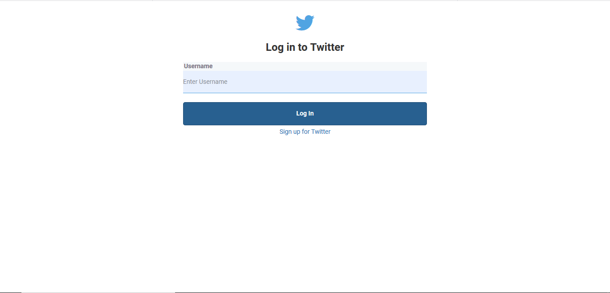
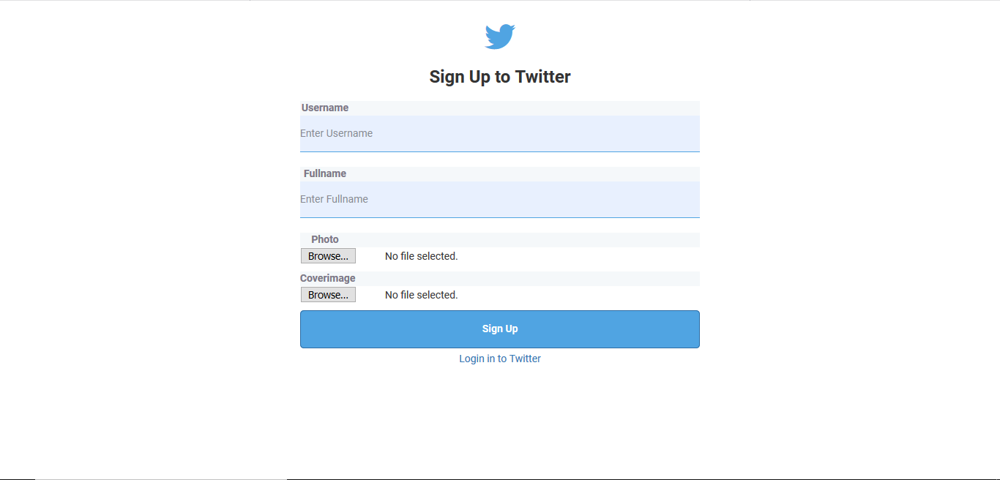
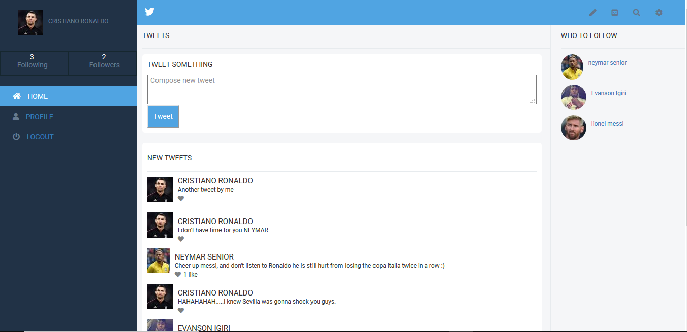

# Twitter Redesign

> In this project, I redesign a popular micro-blogging platform `twitter.com` also mocking the basic functionalities of the applcation.

## Built With

- Ruby v2.6.5
- Ruby on Rails v6.0.3
- Gems used for testing: Capybara, Rspec-Rails, Shoulda-matchers and FactoryBot

## Live Demo

[Heroku App Link]()

## screenshots

### login page

### Signup page

### Homepage

### Userpage


## Getting Started

To get a local copy up and running follow these steps:

### Prerequisites

- Ruby: 2.6.5
- Rails: 6.0.3
- Postgres: >=9.5
- Git

### Usage

- Fork/Clone this project to your local machine
- Open folder in your local enviroment and run these lines of code to get started:

Install gems with:

```Ruby
    bundle install
```

Setup database with:

```Ruby
   rails db:migrate
```

Start server with:

```Ruby
    rails server
```

Then open a web page and go to [port 3000 on your local machine.](http://localhost:3000)

### Running tests

```Ruby
    rspec
```

### Deployment

The application was deployed on heroku.
To deploy your own copy, you can follow the following [steps:](https://devcenter.heroku.com/articles/git)

## Authors

👤 **Evanson Igiri**

- Github: [@evansinho](https://github.com/evansinho)
- Twitter: [@iamevanson](https://twitter.com/iamevanson)
- Linkedin: [evanson-igiri](https://linkedin.com/evanson-igiri)

## 🤝 Contributing

Contributions and feature requests are welcome!

Start by:

- Forking the project
- Cloning the project to your local machine
- `cd` into the project directory
- Run `git checkout -b your-branch-name`
- Make your contributions
- Push your branch up to your forked repository
- Open a Pull Request with a detailed description to the development(or master if not available) branch of the original project for a review

## Show your support

Give a ⭐️ if you like this project!

## Acknowledgments

- You can access all the design info (color, typography, layouts) in this link:

 (https://www.behance.net/gregoirevella)

Design idea by [Gregoire Vella](https://www.behance.net/gregoirevella).
